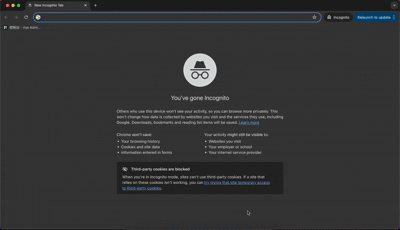

# Hub

Online demo link: https://onlylonger.github.io/rspack-mf-mf-hub/

Plugin-a source link: https://github.com/Onlylonger/rspack-mf-mf-plugin.  
Plugin-a Online demo link: https://onlylonger.github.io/rspack-mf-mf-plugin

This is an MVP implementation of micro-frontends, based on module federation technology. The concept draws inspiration from the micro-frontend architecture used in the Hong Kong Hospital Authority (HK HA), but the implementation differs in the following ways:

- The project is built using the **Rsbuild (Rspack) ecosystem**, rather than CRA.
- Module Federation is handled using an **independent Module Federation package** (@module-federation/enhanced), rather than webpack's built-in Module Federation.
- All components operate within the **same React App Context scope**, enabling shared Context usage and supporting only React. Plugins do not create new React/Vue/... contexts each time.
- **Multi-tab and detail page caching** are supported. Plugins only support registering first-level dynamic routes and do not support nested routes.
- The implementation logic is **clearer and easier to maintain**.
